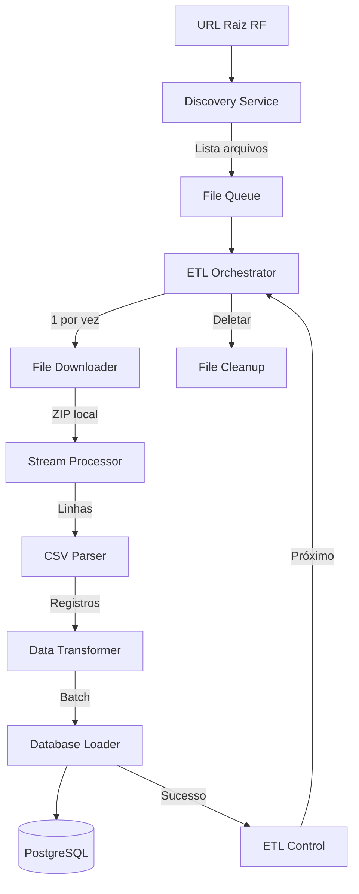
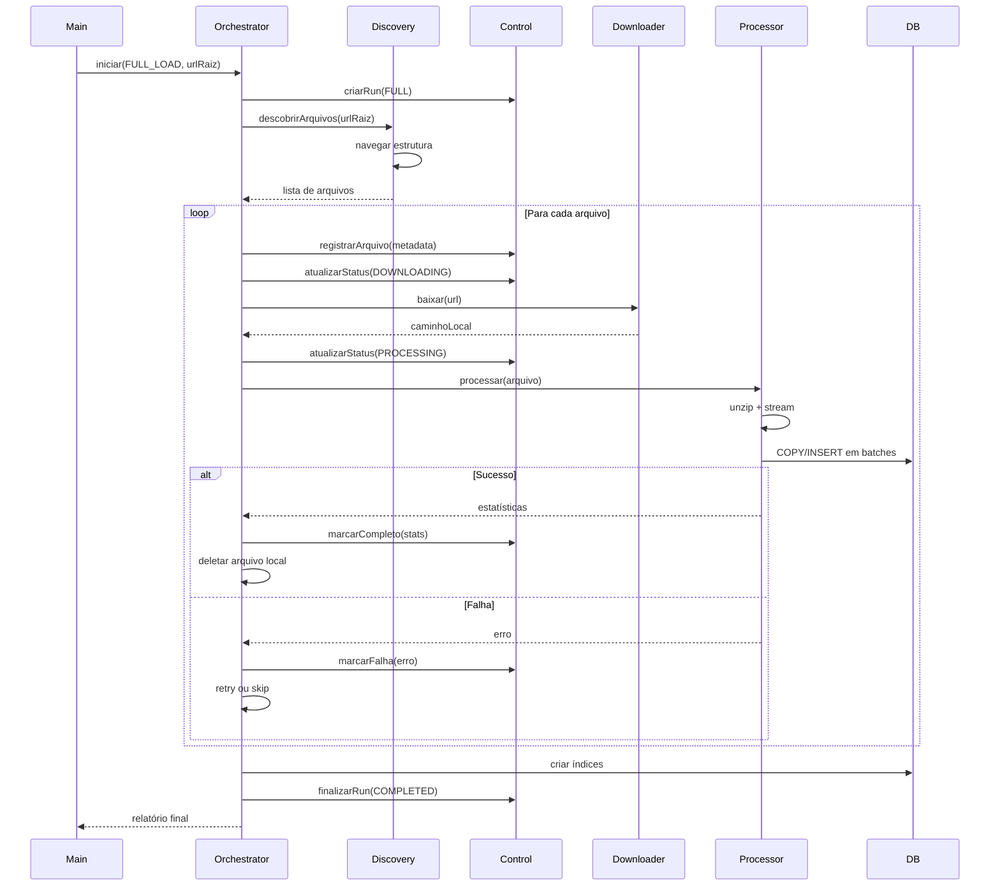
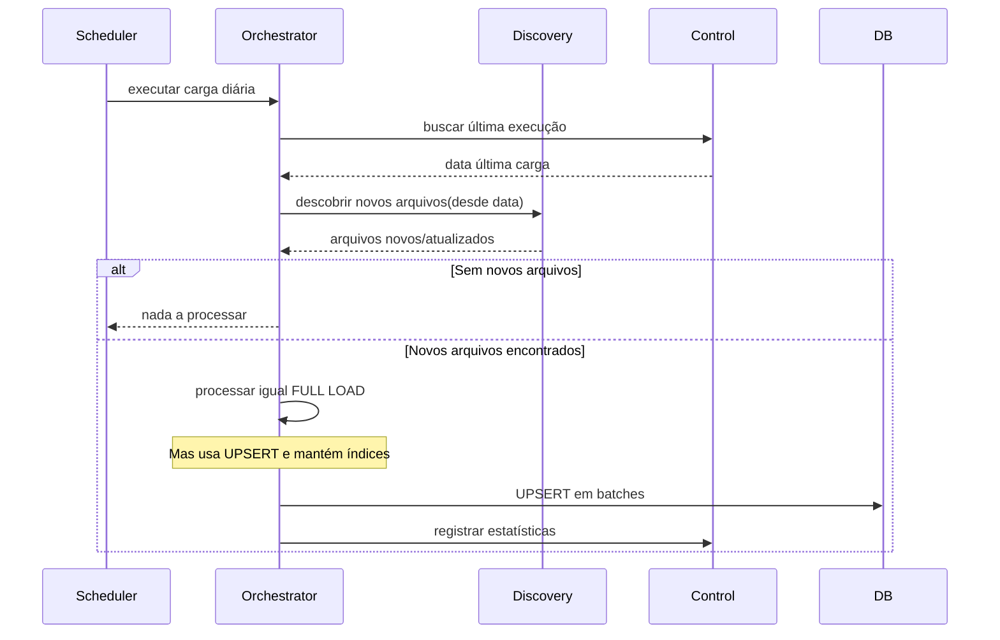
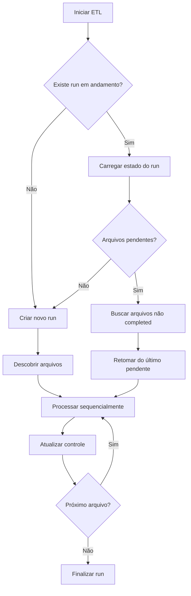

# Arquitetura ETL - Receita Federal do Brasil (V1 - MVP Pragmático)

## IMPORTANTE: Foco no MVP

Este plano descreve um **MVP funcional e robusto**, não uma solução super-otimizada.

**Filosofia**: Fazer funcionar primeiro, otimizar depois com dados reais.

### Principais Ajustes para V1 (Realidade vs Over-Engineering)

**1. Máquina de Estados Simplificada**
- ❌ ~~6 estados (PENDING, DOWNLOADING, PROCESSING, COMPLETED, FAILED, SKIPPED)~~
- ✅ 4 estados (PENDING, PROCESSING, DONE, ERROR)
- ❌ ~~Circuit breaker, backoff exponencial, heartbeat~~
- ✅ Loop simples com try/catch, retry manual

**2. Database Loader Pragmático**
- ❌ ~~COPY FROM STDIN, UNLOGGED tables, drop/recreate índices~~
- ✅ Batch INSERT simples para FULL e DELTA
- ✅ Índices mantidos sempre
- **Otimização vem depois com números reais**

**3. Observabilidade Minimalista**
- ❌ ~~Logs JSON estruturados, dashboard, métricas, alertas~~
- ✅ Console + arquivo texto simples
- ✅ Registros no banco (etl_control_files)

**4. Hash: Uso Correto**
- ❌ ~~Hash como critério principal de DELTA~~
- ✅ DELTA baseado em ano/mês não processados
- ✅ Hash apenas para evitar reprocessar no mesmo run (memória, não banco)
- **Receita republica arquivos inteiros mesmo com poucas mudanças**

**5. Tratamento de Erros Simplificado**
- ❌ ~~Retry automático, circuit breaker, backoff exponencial~~
- ✅ Falhar rápido, logar bem, retry manual
- ✅ Rodar ETL novamente = retoma de onde parou

**Estimativa realista**: V1 funcional em 2-3 semanas. FULL LOAD demora 10-15h (batch INSERT). V2 otimizado reduz para 3-5h (COPY + índices).

## 1. Visão Geral da Arquitetura

Sistema ETL desacoplado em camadas, processando dados governamentais de forma sequencial e resiliente:



### Princípios Arquiteturais (V1)

- **Simplicidade**: Código claro e direto, sem abstrações desnecessárias
- **Funcionalidade Primeiro**: Fazer funcionar antes de otimizar
- **Memory Efficient**: Processamento streaming sem carregar arquivos completos
- **Recuperável**: Capaz de retomar de onde parou
- **Observável**: Logs simples e registros no banco

## 2. Componentes Principais

### 2.1 Discovery Service

**Responsabilidade**: Navegar na estrutura de diretórios da Receita Federal e descobrir arquivos disponíveis.

**Entradas**:

- URL raiz (ex: `https://dadosabertos.rfb.gov.br/CNPJ/`)
- Tipo de carga (FULL ou DELTA)

**Saídas**:

- Lista de arquivos descobertos com metadados:
  - URL completa
  - Nome do arquivo
  - Tipo (Estabelecimentos, Socios, Municipios, etc.)
  - Ano/mês de referência
  - Tamanho estimado

**Funcionamento**:

1. Faz requisição HTTP GET na URL raiz
2. Parseia HTML para identificar links (diretórios de ano)
3. Para cada ano, busca meses (se existirem)
4. Para cada diretório, lista arquivos `.zip`
5. Extrai metadados do nome do arquivo (padrão Receita)
6. Retorna estrutura ordenada para processamento

**Decisão técnica**: Usar `cheerio` ou regex para parsing HTML (leve e eficiente).

---

### 2.2 ETL Orchestrator

**Responsabilidade**: Coordenar o fluxo completo do ETL, garantindo processamento sequencial e resiliente.

**Funções (V1 - Simplificado)**:

- Controlar fila de arquivos a processar
- Invocar componentes na ordem correta
- Registrar progresso no banco de controle
- Decidir quando pular arquivos já processados

**Estados gerenciados (V1 - 4 estados simples)**:

- `PENDING`: Arquivo descoberto, aguardando processamento
- `PROCESSING`: Arquivo em processamento (download + parse + load)
- `DONE`: Arquivo processado com sucesso
- `ERROR`: Falha no processamento

**V2 (Futuro)**:

- Estados granulares (DOWNLOADING, PROCESSING separados)
- Retry logic com backoff exponencial
- Circuit breaker para falhas persistentes
- Heartbeat para detectar crashes

**Decisão técnica V1**: Loop simples com try/catch e registro de status.

---

### 2.3 File Downloader

**Responsabilidade**: Baixar arquivos ZIP da Receita Federal de forma eficiente.

**Entradas**:

- URL do arquivo
- Caminho de destino temporário

**Saídas**:

- Caminho do arquivo baixado localmente

**Funcionamento (V1)**:

1. Stream HTTP direto para disco (sem buffer em memória)
2. Log simples de início/fim de download
3. Se falhar, propagar erro (orchestrator decide o que fazer)

**V2 (Futuro)**:

- Cálculo de hash durante download
- Retry automático com backoff
- Progress tracking detalhado

**Decisão técnica**: Usar `axios` com `stream.pipeline` para eficiência máxima.

---

### 2.4 Stream Processor

**Responsabilidade**: Descompactar e processar arquivos ZIP linha a linha via streaming.

**Entradas**:

- Caminho do arquivo ZIP local
- Tipo de arquivo (Estabelecimentos, Socios, Municipios)

**Saídas**:

- Stream de linhas CSV para o Parser

**Funcionamento**:

1. Abre arquivo ZIP com `unzipper` ou `yauzl`
2. Para cada arquivo CSV dentro do ZIP:

   - Cria readable stream
   - Pipe para parser CSV
   - Processa linha a linha (nunca carregar tudo)

3. Emite eventos de progresso (linhas processadas)

**Decisão técnica**: `yauzl` para descompactação streaming nativa.

---

### 2.5 CSV Parser

**Responsabilidade**: Interpretar linhas CSV do padrão Receita Federal.

**Entradas**:

- Stream de texto (linhas CSV)
- Schema do tipo de arquivo

**Saídas**:

- Objetos JavaScript estruturados

**Funcionamento**:

1. Usar `csv-parser` ou `papaparse` em modo stream
2. Aplicar schema específico de cada tipo:

   - Estabelecimentos: 30+ colunas
   - Socios: 15+ colunas
   - Municipios: 3 colunas

3. Validação básica de tipos e obrigatoriedade
4. Emitir erros de parsing sem interromper stream

**Decisão técnica**: `csv-parser` por performance e simplicidade.

---

### 2.6 Data Transformer

**Responsabilidade**: Transformar dados brutos em formato adequado ao banco.

**Entradas**:

- Objetos parseados do CSV

**Saídas**:

- Objetos normalizados e validados

**Transformações**:

- Conversão de tipos (strings para números, datas)
- Normalização de CPF/CNPJ (remover caracteres, validar)
- Tratamento de valores nulos/vazios
- Limpeza de caracteres especiais
- Aplicar regras de negócio (ex: status ativo/baixado)
- Enriquecimento de dados (ex: extrair matriz/filial do CNPJ)

**Decisão técnica**: Transformadores específicos por tipo de entidade (estratégia).

---

### 2.7 Database Loader

**Responsabilidade**: Persistir dados no PostgreSQL de forma eficiente e segura.

**Entradas**:

- Stream de objetos transformados
- Tipo de carga (FULL ou DELTA)

**Saídas**:

- Registros inseridos/atualizados
- Estatísticas de carga

**Estratégias de carga (V1 - Simplificado)**:

**FULL LOAD**:

- Truncar tabelas antes de iniciar: `TRUNCATE TABLE estabelecimentos CASCADE`
- Inserção em batch (1000 registros por vez)
- Usar batch INSERT simples: `INSERT INTO ... VALUES ($1, $2, ...), ($3, $4, ...), ...`
- Commit a cada batch
- **Índices mantidos** (criados apenas depois da primeira carga)

**DELTA**:

- `UPSERT` via `ON CONFLICT DO UPDATE`
- Batch de 1000 registros
- Índices mantidos
- Timestamp de atualização para rastrear mudanças

**Funcionamento (V1)**:

1. Acumular registros em buffer (batch de 1000)
2. Quando buffer cheio, executar INSERT em transação
3. Commit e liberar memória
4. Continuar até fim do stream
5. Log de estatísticas (registros inseridos/atualizados)

**V2 (Otimizações futuras - quando tiver números reais)**:

- `COPY FROM STDIN` para FULL LOAD (3-5x mais rápido)
- Drop/recreate de índices durante FULL LOAD
- UNLOGGED tables durante carga inicial
- Tuning de PostgreSQL (maintenance_work_mem, etc)
- VACUUM ANALYZE automatizado

**Decisão técnica V1**:

- Usar `pg` (driver nativo PostgreSQL)
- Connection pool simples (default)
- Batch INSERT para ambos FULL e DELTA
- **Só otimizar quando a carga estiver funcionando e você tiver números reais**

---

### 2.8 ETL Control (Gerenciamento de Estado)

**Responsabilidade**: Controlar estado de processamento e permitir retomada.

**Tabela: `etl_control_files` (V1 - Simplificado)**:

```sql
CREATE TABLE etl_control_files (
    id SERIAL PRIMARY KEY,
    file_name VARCHAR(255) UNIQUE NOT NULL,
    file_url TEXT NOT NULL,
    file_type VARCHAR(50) NOT NULL, -- 'estabelecimentos', 'socios', 'municipios'
    file_year INTEGER,
    file_month INTEGER,
    load_type VARCHAR(10) NOT NULL, -- 'FULL' ou 'DELTA'
    status VARCHAR(20) NOT NULL, -- 'pending', 'processing', 'done', 'error'
    records_inserted INTEGER DEFAULT 0,
    records_updated INTEGER DEFAULT 0,
    started_at TIMESTAMP,
    completed_at TIMESTAMP,
    error_message TEXT,
    created_at TIMESTAMP DEFAULT NOW()
);

CREATE INDEX idx_etl_status ON etl_control_files(status);
CREATE INDEX idx_etl_type_date ON etl_control_files(file_type, file_year, file_month);
```

**Tabela: `etl_control_runs` (V1 - Simplificado)**:

```sql
CREATE TABLE etl_control_runs (
    id SERIAL PRIMARY KEY,
    run_type VARCHAR(10) NOT NULL, -- 'FULL' ou 'DELTA'
    status VARCHAR(20) NOT NULL, -- 'running', 'completed', 'error'
    total_files INTEGER,
    files_completed INTEGER DEFAULT 0,
    files_failed INTEGER DEFAULT 0,
    started_at TIMESTAMP DEFAULT NOW(),
    completed_at TIMESTAMP,
    error_message TEXT
);
```

**Campos removidos do V1** (adicionar depois se necessário):

- `attempt_count` (retry logic é V2)
- `records_processed` (suficiente ter inserted/updated)
- `records_failed` (complexo de rastrear, log é suficiente)
- `file_hash` (usar apenas para evitar reprocessar no mesmo run, não armazenar)
- `updated_at` (heartbeat é V2)

**Funcionalidades (V1)**:

- Registrar descoberta de novos arquivos
- Atualizar status (PENDING → PROCESSING → DONE ou ERROR)
- Marcar conclusão com estatísticas básicas
- Consultar arquivos PENDING para retomada
- Query simples: "Quais arquivos ainda não foram processados?"

---

## 3. Fluxo de Dados Detalhado

### 3.1 Fluxo FULL LOAD



### 3.2 Fluxo DELTA (Incremental)



### 3.3 Fluxo de Retomada após Falha



---

## 4. Estratégia de Controle de Estado

### 4.1 Idempotência e Segurança

**Prevenção de Duplicação**:

- Chave única no banco: `CONSTRAINT uk_cnpj UNIQUE (cnpj_basico, cnpj_ordem, cnpj_dv)`
- Para DELTA: usar `ON CONFLICT DO UPDATE` com timestamp
- Registrar hash do arquivo processado (evitar reprocessar mesmo arquivo)

**Checkpoint Strategy**:

- Commit a cada batch (1000 registros)
- Se falhar no meio do arquivo, reiniciar do início do arquivo (não do meio)
- Usar transações por arquivo completo (ou batches com idempotência)

**Registro de Progresso**:

- Atualizar `etl_control_files.records_processed` a cada 10.000 linhas
- Atualizar `updated_at` para heartbeat
- Em caso de crash, consultar último registro completo

### 4.2 Tratamento de Erros (V1 - Simplificado)

**Estratégia geral**: Falhar rápido, logar bem, permitir retry manual.

**Níveis de Erro**:

1. **Erro de Rede** (download):

   - Falhar imediatamente
   - Marcar arquivo como ERROR
   - Logar URL e mensagem de erro
   - **Retry manual** (rodar ETL novamente, ele retoma do erro)

2. **Erro de Parsing** (linha corrompida):

   - Logar linha problemática (console + arquivo)
   - Continuar processamento (não abortar arquivo inteiro)
   - Registrar que houve erros no log final

3. **Erro de Banco** (constraint, conexão):

   - Se erro de conexão: falhar arquivo inteiro
   - Se erro de constraint duplicate key: logar e continuar (dado já existe)
   - Outros erros: falhar arquivo e investigar

**Logs (V1 - Simples)**:

Console e arquivo texto:

```
[2026-01-14 10:30:00] ERROR | downloader | Estabelecimentos0.zip | Falha no download: timeout
[2026-01-14 10:35:12] WARN  | parser | Socios1.zip | Linha 15032 com erro de parsing
[2026-01-14 11:20:45] INFO  | loader | Estabelecimentos0.zip | 150000 registros inseridos
```

**V2 (Futuro)**:

- Logs JSON estruturados (para ferramentas de agregação)
- Retry automático com backoff
- Circuit breaker
- Métricas de taxa de erro
- Alertas automáticos

---

## 5. Estratégia FULL LOAD vs DELTA

### 5.1 FULL LOAD (Carga Inicial) - V1

**Quando executar**:

- Primeira vez do sistema
- Rebuild completo do banco (manutenção)
- Mudança de schema

**Processo (V1 - Simples e Funcional)**:

1. Truncar tabelas: `TRUNCATE TABLE estabelecimentos, socios CASCADE`
2. Processar todos os arquivos disponíveis
3. Inserção em batch (1000 registros por vez)
4. Commit a cada batch
5. Índices já existem (criados no schema inicial)

**Tempo estimado** (V1 - batch INSERT simples):

- ~50GB de dados compactados
- ~200GB descompactados
- Processamento: **10-15 horas** (batch INSERT é mais lento que COPY, mas funciona)

**Ordem de processamento**:

1. Municípios (pequeno, tabela auxiliar)
2. Estabelecimentos (grande)
3. Socios (médio)

**V2 (Otimizações futuras - quando tiver números reais)**:

- `COPY FROM STDIN` (3-5x mais rápido)
- Drop/recreate índices durante carga
- UNLOGGED tables temporariamente
- Tuning de PostgreSQL
- VACUUM ANALYZE automatizado
- **Reduzir tempo de 10-15h para 3-5h**

### 5.2 DELTA (Carga Incremental)

**Quando executar**:

- Diariamente ou semanalmente, via cron/scheduler
- Receita Federal publica atualizações **mensais** (geralmente)
- Verificar se há novos arquivos antes de executar

**Estratégia (V1)**:

```sql
INSERT INTO estabelecimentos (cnpj, razao_social, ..., updated_at)
VALUES ($1, $2, ..., NOW())
ON CONFLICT (cnpj)
DO UPDATE SET
    razao_social = EXCLUDED.razao_social,
    ...,
    updated_at = NOW();
```

**Detecção de Novos Arquivos** (IMPORTANTE - Critério correto):

**Critério principal**: Ano/mês ainda não processados

- Discovery busca arquivos disponíveis
- Compara com `etl_control_files` por `(file_type, file_year, file_month)`
- Processa arquivos com ano/mês não marcados como DONE

**Hash** (uso limitado):

- Calcular hash apenas no começo do run
- Armazenar em memória durante o run (não no banco)
- Serve apenas para **evitar reprocessar o mesmo arquivo duas vezes no mesmo run**
- **NÃO é critério de DELTA** (Receita republica arquivos inteiros mesmo com poucas mudanças)

**Performance**:

- Manter índices ativos
- Batch de 1000 registros
- UPSERT via ON CONFLICT
- Tempo esperado: 1-3h (dependendo do volume de mudanças)

---

## 6. Decisões Técnicas Justificadas

### 6.1 Stack Tecnológica

**Node.js**:

- Streams nativos e eficientes
- Ecosystem maduro para ETL (csv-parser, yauzl, pg)
- Async/await simplifica código complexo

**PostgreSQL**:

- JSONB para campos flexíveis
- Índices GIN/GIST para buscas avançadas
- UPSERT nativo (ON CONFLICT)
- Full-text search (tsvector)
- Excelente performance para leitura e escrita

**Sem ORM**:

- Performance crítica em ETL
- Controle fino de queries (COPY, UPSERT)
- Sem overhead de abstração
- SQL nativo é mais transparente

### 6.2 Processamento Streaming

**Por que streaming?**:

- Arquivos de 1-5GB cada (não cabem em memória)
- Reduz latência (processar enquanto baixa)
- Permite processamento de arquivos maiores que RAM disponível

**Implementação**:

```
HTTP Stream → Unzip Stream → CSV Parse Stream → Transform Stream → DB Batch Writer
```

### 6.3 Controle de Concorrência

**Processamento Sequencial** (não paralelo):

- Receita Federal pode rate-limit downloads
- Evita sobrecarga de memória/CPU
- Controle de estado mais simples
- Retry mais previsível

**Se futuramente precisar de paralelismo**:

- Usar fila (Bull, BullMQ)
- Worker pool com limite (ex: 3 workers)
- Controle de estado via tabela central

### 6.4 Armazenamento de Dados

**Schema Normalizado**:

- `estabelecimentos`: tabela principal (30+ colunas)
- `socios`: relacionamento N:N via CNPJ
- `municipios`: tabela auxiliar (FK em estabelecimentos)

**Particionamento** (opcional para escala):

- Particionar `estabelecimentos` por UF ou faixa de CNPJ
- Melhora performance de queries regionais

**Índices Essenciais**:

```sql
CREATE INDEX idx_estabelecimento_cnpj ON estabelecimentos(cnpj);
CREATE INDEX idx_estabelecimento_situacao ON estabelecimentos(situacao_cadastral);
CREATE INDEX idx_estabelecimento_municipio ON estabelecimentos(codigo_municipio);
CREATE INDEX idx_socio_cnpj ON socios(cnpj_basico);
CREATE INDEX idx_socio_cpf_cnpj ON socios(cpf_cnpj_socio);
```

---

## 7. Ordem Recomendada de Implementação (V1 - Pragmática)

### Fase 1: Setup Básico (1-2 dias)

1. Criar projeto Node.js (package.json, estrutura de pastas)
2. Configurar conexão PostgreSQL
3. Criar schema do banco (tabelas principais + controle)
4. Setup de log simples (console + arquivo)
5. Arquivo `.env` com configurações

**Entregável**: Conectar no banco e rodar query de teste

### Fase 2: Discovery (1 dia)

6. Implementar Discovery Service

   - HTTP request para URL raiz
   - Parser HTML (cheerio ou regex)
   - Extrair lista de arquivos com metadados

7. CLI para testar discovery: `node src/cli/discovery.js`

**Entregável**: Listar todos os arquivos disponíveis na Receita Federal

### Fase 3: Pipeline de Processamento (3-4 dias)

8. Implementar File Downloader (stream para disco)
9. Implementar Stream Processor (unzip + CSV parse)
10. Criar Transformer para **UM tipo primeiro** (ex: Municípios - mais simples)
11. Implementar Database Loader (batch INSERT)
12. Testar pipeline completo com 1 arquivo pequeno

**Entregável**: Processar arquivo de Municípios do começo ao fim

### Fase 4: Completar Transformers (2-3 dias)

13. Implementar Transformer de Estabelecimentos
14. Implementar Transformer de Sócios
15. Ajustar schemas do banco conforme necessário
16. Testar com arquivos reais (1 de cada tipo)

**Entregável**: Processar os 3 tipos de arquivo

### Fase 5: Orchestração e Controle (2-3 dias)

17. Implementar ETL Control (queries de estado)
18. Implementar Orchestrator simples (loop de arquivos)
19. Registrar status (PENDING → PROCESSING → DONE/ERROR)
20. Implementar cleanup de arquivos temporários
21. Testar retomada após falha manual

**Entregável**: ETL completo que processa todos os arquivos sequencialmente

### Fase 6: Modo FULL LOAD (1 dia)

22. CLI para rodar FULL LOAD: `node src/cli/full-load.js <URL>`
23. Truncate de tabelas
24. Processar todos os arquivos
25. Rodar primeira carga completa (deixar overnight)

**Entregável**: Base de dados populada completamente

### Fase 7: Modo DELTA (2 dias)

26. Implementar detecção de novos arquivos (ano/mês)
27. Trocar INSERT por UPSERT (ON CONFLICT)
28. CLI para rodar DELTA: `node src/cli/delta.js <URL>`
29. Testar carga incremental

**Entregável**: Sistema de carga incremental funcional

### Fase 8: Polimento Final (1-2 dias)

30. Melhorar logs e mensagens de erro
31. Documentar comandos e configuração (README)
32. Script de inicialização do banco (migrations)
33. Criar cron job ou scheduler para DELTA diário

**Entregável**: Sistema rodando em produção com carga diária automatizada

**Total estimado V1: 13-18 dias úteis**

### V2 (Implementar DEPOIS, quando tiver números reais):

- Otimizações de performance (COPY FROM STDIN)
- Retry automático e circuit breaker
- Logs estruturados (JSON)
- Métricas e dashboards
- Testes automatizados
- Monitoramento avançado

---

## 8. Estrutura de Diretórios Proposta (V1 - Simplificado)

```
etl-receita-federal/
├── src/
│   ├── config/
│   │   ├── database.js          # Configuração PostgreSQL (pool)
│   │   ├── logger.js            # Log simples (console + arquivo)
│   │   └── constants.js         # URLs, batch size, timeouts
│   ├── services/
│   │   ├── discovery.js         # Discovery Service
│   │   ├── downloader.js        # File Downloader
│   │   ├── processor.js         # Stream Processor (unzip + parse)
│   │   ├── loader.js            # Database Loader (batch INSERT)
│   │   └── control.js           # ETL Control (queries de estado)
│   ├── transformers/
│   │   ├── estabelecimento.js   # Transformer específico
│   │   ├── socio.js
│   │   └── municipio.js
│   ├── orchestrator.js          # Orquestrador (loop simples)
│   └── cli/
│       ├── full-load.js         # Comando: node src/cli/full-load.js
│       ├── delta.js             # Comando: node src/cli/delta.js
│       └── discovery-test.js    # Teste: listar arquivos disponíveis
├── sql/
│   ├── schema.sql               # Schema completo (criar tabelas)
│   └── drop.sql                 # Script para limpar banco (dev)
├── logs/                        # Logs em arquivo texto (gitignore)
├── temp/                        # Downloads temporários (gitignore)
├── .env.example                 # DB_HOST, DB_PORT, etc
├── .gitignore
├── package.json
└── README.md                    # Comandos e configuração
```

**Arquivos removidos do V1** (adicionar depois se necessário):
- `copy-loader.js` (otimização V2)
- `state-machine.js` (loop simples é suficiente)
- `retry.js` (retry manual por enquanto)
- `validation.js` (validar inline nos transformers)
- `metrics.js` (observabilidade é V2)
- `status.js` (query direta no banco por enquanto)
- `indexes.sql` (índices criados no schema.sql)
- `migrations/` (V1 não precisa de migrations)

---

## 9. Considerações Finais

### Pontos de Atenção (V1)

- **Espaço em Disco**: Garantir 10-15GB livres para processamento (1 arquivo por vez)
- **Tempo de Execução**: FULL LOAD vai demorar (10-15h), rodar overnight
- **Backup**: Fazer backup do PostgreSQL antes de FULL LOAD
- **Variação de Layout**: Se a Receita mudar estrutura de diretórios, ajustar Discovery Service
- **Timeout HTTP**: Downloads podem demorar (arquivos grandes), configurar timeout alto (5-10 min)

### O que NÃO fazer no V1

❌ **Não implementar**: rate limiting, throttling, politeness delays
❌ **Não criar**: dashboards, métricas complexas, alertas automáticos  
❌ **Não otimizar**: antes de ter números reais de performance
❌ **Não adicionar**: paralelismo, workers, filas
❌ **Não fazer**: over-engineering de logs, observabilidade, monitoramento

### Quando Otimizar (V2)

Só adicione complexidade quando:
- ✅ V1 estiver funcionando end-to-end
- ✅ Você tiver rodado FULL LOAD completo
- ✅ Você tiver números reais de performance
- ✅ Identificar gargalos reais (não imaginados)

**Otimizações mais prováveis de serem necessárias**:
1. COPY FROM STDIN (3-5x mais rápido que batch INSERT)
2. Drop/recreate de índices durante FULL LOAD
3. Retry automático para downloads (evitar intervenção manual)

### Próximos Passos Após V1

**Escala** (se necessário):
- Paralelismo controlado (2-3 arquivos simultâneos)
- Particionamento de tabelas por UF
- Connection pool otimizado

**Produto** (se for expor dados):
- API REST/GraphQL para consultas
- Cache Redis para queries frequentes
- Full-text search otimizado

**Operação** (se virar crítico):
- Monitoramento automatizado
- Alertas de falha
- Logs estruturados (JSON) para agregação

---

## 10. Resumo: V1 vs V2

| Aspecto | V1 (MVP - 2-3 semanas) | V2 (Otimização - quando necessário) |
|---------|------------------------|--------------------------------------|
| **Estados** | 4 simples (PENDING, PROCESSING, DONE, ERROR) | 6+ granulares + heartbeat |
| **Database Loader** | Batch INSERT (ambos FULL e DELTA) | COPY FROM STDIN para FULL |
| **Índices** | Mantidos sempre | Drop/recreate durante FULL LOAD |
| **Retry** | Manual (rodar ETL novamente) | Automático com backoff |
| **Logs** | Console + arquivo texto simples | JSON estruturado para agregação |
| **Erro de Parsing** | Logar e continuar | Contador + threshold + falha inteligente |
| **Observabilidade** | Logs + registros no banco | Métricas, dashboard, alertas |
| **Hash** | Não armazenar | Armazenar para auditoria |
| **Performance FULL** | 10-15 horas | 3-5 horas (com otimizações) |
| **Concorrência** | 1 arquivo por vez | 2-3 arquivos simultâneos (opcional) |

**Filosofia do V1**: Fazer funcionar, aprender com uso real, otimizar com dados reais.

---

Esta arquitetura V1 prioriza **entregar um sistema funcional rapidamente**, sem over-engineering. Cada componente tem responsabilidade clara e o código será simples de entender e manter. Otimizações virão depois, baseadas em necessidade real.